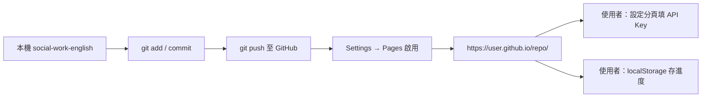

# 🎓 社工英文學習助手

專為香港成人社工學生設計的英文學習 Web App，幫助你掌握社工專業英文詞彙、寫作測試、情境造句，並透過選擇題和測驗鞏固記憶。

## 功能模組

| 模組 | 說明 |
|------|------|
| 📝 寫作測試 | 分難度英文寫作（初級供詞/中級不供詞，不執著文法） |
| 📚 詞彙查詢 | 輸入中文概念，查詢專業英文術語 |
| ✍️ 情境造句 | 生成社工場景英文練習句 + 抄寫對比 |
| 🗂️ 詞彙庫 | 瀏覽 30 個核心社工英文詞彙 |
| 📖 生字學習 | 選擇題 + 填空 + 間隔複習（可選 AI 補充主題） |
| 🧪 測驗模式 | 三種題型（可選 AI 補充主題） |

## 題庫與 AI 合併使用

- **單一流程**：生字學習和測驗都只有一個「開始」按鈕，不再分離線/AI 兩套
- **無 API**：自動使用本地題庫（內建 30 詞 + 已存詞彙）
- **有 API**：同上，並可選填「AI 補充主題」→ 系統先補充新詞存入題庫，再與待複習詞彙一起練習/測驗
- 右上角指示燈顯示連線狀態；連接成功後會自動顯示 AI 選填欄位

## 資料備份與同步

| 方式 | 說明 |
|------|------|
| 📤 匯出 JSON | 設定分頁 → 匯出，手動複製到其他裝置 |
| 📥 合併/覆蓋匯入 | 從 JSON 還原進度、連續天數、AI 詞彙 |
| 🐙 GitHub Gist | 設定分頁填入 GitHub Token（`gist` 權限），上傳/下載私有 Gist |

- 學習進度預設存在各裝置 localStorage，**不會自動跨裝置同步**
- 合併匯入時，同一詞彙以 `lastSeen` 較新的紀錄為準
- 可啟用「自動上傳至 GitHub」，學習資料變更約 5 秒後同步

## 題庫管理

- 內建 30 詞 + 本地已存詞彙（`sw_custom_terms`）
- 詞彙庫：來源篩選、刪除、匯出/匯入 JSON
- 詞彙查詢結果可「加入離線題庫」

## API 連線指示燈

右上角顯示 DeepSeek API 狀態（點擊可重新檢查）：

| 狀態 | 說明 |
|------|------|
| 🟢 API 已連接 | Key 有效且連線成功 |
| 🔴 API 連接失敗 | Key 已設定但無法連線 |
| ⚫ 未設定 API | 尚未在「設定」填入 API Key |

## 快速開始

### 1. 設定 API Key

**方式 A：設定分頁（推薦，適用 GitHub Pages）**

1. 開啟 App → **⚙️ 設定** 分頁
2. 填入 [DeepSeek API Key](https://platform.deepseek.com/) → **儲存並測試**
3. Key 僅存於本裝置瀏覽器

**方式 B：本地 config.js（開發用）**

```bash
# 複製範本並填入你的 DeepSeek API Key
cp config.example.js config.js
```

編輯 `config.js`，將 `your_api_key_here` 替換為你的 API Key。localStorage 中的 Key 優先於 config.js。

> ⚠️ **安全提醒**：`config.js` 已加入 `.gitignore`，不會被提交到 Git。由於這是純前端應用，API Key 會在瀏覽器中暴露，**僅建議用於個人學習**，請勿在公開場合分享你的 Key。

### 2. 本地運行

由於使用了 `fetch` 載入 JSON 和呼叫 API，需要透過 HTTP 伺服器開啟（不能直接雙擊 HTML 檔案）。

**方法 A：使用 npx（推薦）**

```bash
cd social-work-english
npx serve .
```

然後在瀏覽器開啟 `http://localhost:3000`

**方法 B：使用 Python**

```bash
cd social-work-english
python -m http.server 8080
```

然後在瀏覽器開啟 `http://localhost:8080`

**方法 C：使用 VS Code Live Server 擴充功能**

在 VS Code 中右鍵 `index.html` → Open with Live Server

## GitHub Pages 部署

以下說明如何把此 App 放到 GitHub，並用 **GitHub Pages** 提供公開網址。  
部署後，**網頁是公用的**；API Key 與學習進度由**各使用者在本機瀏覽器**各自設定（見「部署後：使用者要做什麼」）。

---

### 事前準備

| 項目 | 說明 |
|------|------|
| GitHub 帳號 | [github.com](https://github.com) 註冊 |
| Git | 本機已安裝 [Git](https://git-scm.com/) |
| 專案資料夾 | `social-work-english/`（含 `index.html`） |

> ⚠️ **切勿提交 `config.js`**：此檔含 API Key，已在 `.gitignore`。公開 repo 只推送程式碼，不推送 Key。

---

### 方式 A：獨立 Repo（推薦，最簡單）

適合：只部署這個學習 App，Pages 網址即為網站根目錄。

#### 步驟 1：在 GitHub 建立新 Repo

1. 登入 GitHub → 右上角 **+** → **New repository**
2. Repository name 例如：`social-work-english`
3. 選 **Public**（Pages 免費方案需公開 repo，或改用 GitHub Pro 私人 Pages）
4. **不要**勾選 README / .gitignore（本機已有）
5. 按 **Create repository**

#### 步驟 2：本機初始化並推送

在終端機（PowerShell 或 Git Bash）執行：

```bash
# 進入專案資料夾
cd social-work-english

# 初始化 Git（若尚未初始化）
git init

# 確認 config.js 不會被提交
git status
# 應看不到 config.js；若看到，請勿 git add config.js

# 加入所有檔案並提交
git add .
git commit -m "Initial commit: 社工英文學習助手"

# 連接遠端（將 YOUR_USERNAME 換成你的 GitHub 使用者名稱）
git branch -M main
git remote add origin https://github.com/YOUR_USERNAME/social-work-english.git

# 推送到 GitHub
git push -u origin main
```

#### 步驟 3：開啟 GitHub Pages

1. 開啟 repo 頁面 → **Settings** → 左側 **Pages**
2. **Build and deployment**
   - Source：**Deploy from a branch**
   - Branch：`main`　資料夾：`/ (root)`
3. 按 **Save**
4. 等待 1～3 分鐘，頁面上方會顯示網址，例如：  
   `https://YOUR_USERNAME.github.io/social-work-english/`

#### 步驟 4：確認網站正常

1. 用瀏覽器開啟上述網址
2. 應能看到「社工英文學習助手」首頁
3. 點 **詞彙庫**、**生字學習** 確認離線功能正常
4. 右上角可能顯示「未設定 API」— 這是正常的（見下方使用者設定）

---

### 方式 B：Repo 根目錄含多個專案

適合：`SWLearning` 這類 monorepo，根目錄還有其他資料夾。

#### 選項 B1：只把 `social-work-english/` 當 Pages 來源

GitHub **免費 Pages 不支援**「只發布子資料夾」作為根目錄（除非用 Actions 或把檔案移到 `/docs`）。

**做法 1 — 使用 `/docs` 資料夾：**

```bash
# 在 repo 根目錄
mkdir docs
# 複製 App 所有檔案到 docs/（不含 config.js）
cp -r social-work-english/* docs/
# Windows PowerShell 可用：
# Copy-Item -Recurse social-work-english\* docs\

git add docs/
git commit -m "Add GitHub Pages site to docs/"
git push
```

Settings → Pages → Branch: `main` → Folder: **`/docs`**

**做法 2 — 獨立 repo（仍建議方式 A）**  
把 `social-work-english/` 單獨建一個 repo，維護最單純。

#### 選項 B2：子路徑網址

若整站放在 `https://user.github.io/SWLearning/social-work-english/`，需確保所有資源用**相對路徑**（本專案已使用 `css/`、`js/`、`data/` 相對路徑，一般可直接運作）。

---

### 之後更新網站

修改程式後，在本機專案目錄：

```bash
git add .
git commit -m "說明這次改了什麼"
git push
```

GitHub Pages 會在 push 後自動重新部署（通常 1～3 分鐘）。  
可至 repo **Actions** 或 **Settings → Pages** 查看部署狀態。

---

### 部署後：使用者要做什麼

網頁公開後，**每位使用者**（含你自己在各台裝置）需自行設定：

| 項目 | 操作 |
|------|------|
| AI 功能（可選） | 開啟 App → **⚙️ 設定** → 填入 DeepSeek API Key → **儲存並測試** |
| 學習進度 | 預設存在該裝置瀏覽器，換手機不會自動帶過去 |
| 跨裝置同步（可選） | 設定 → 匯出 JSON，或連接 GitHub Token 用 Gist 同步 |

**無 API Key 仍可使用**：內建 30 詞、生字學習、測驗等離線功能。

---

### 部署檢查清單

推送前請確認：

- [ ] `config.js` **不在** `git status` 待提交清單中
- [ ] `index.html`、`data/sw_terms.json`、`js/`、`css/` 都有加入
- [ ] 本地用 `npx serve .` 測試正常
- [ ] Pages 的 Branch / 資料夾設定正確
- [ ] 開啟 Pages 網址後，詞彙庫能載入（非 404）

---

### 常見問題（部署）

**Q：Pages 顯示 404？**

- 確認 Branch 與資料夾（`/ (root)` 或 `/docs`）是否與實際檔案位置一致
- 確認 repo 根目錄（或 `docs/`）下有 `index.html`
- 等待數分鐘後重新整理；必要時 Settings → Pages 重新 Save

**Q：詞彙庫載入失敗？**

- 確認 `data/sw_terms.json` 已 push 到 GitHub
- 用瀏覽器開發者工具 → Network 檢查 JSON 是否 404

**Q：config.js 404 會不會壞掉？**

- 不會。App 已設計成沒有 `config.js` 也能運行；請在 **設定** 分頁填 API Key。

**Q：可以用私人 Repo 嗎？**

- GitHub 免費帳號：私人 repo 的 Pages 需 GitHub Pro，或改公開 repo
- 即使 repo 公開，使用者的 API Key 仍只存在各自瀏覽器，不會寫進 repo

**Q：自訂網域？**

- Settings → Pages → Custom domain，依 GitHub 說明設定 DNS

---

### 部署流程總覽



---

### 部署後設定 API Key（開發者備忘）

GitHub Pages 上不會有 `config.js`（已在 `.gitignore`）。使用者請在 App 的 **⚙️ 設定** 分頁各自填入 DeepSeek API Key 與（可選）GitHub Token。

> 若只在本地開發，仍可使用 `config.js`；不建議將含 Key 的 config.js 提交到公開 repo。

## 技術架構

- **前端**：純 HTML5 + CSS3 + Vanilla JavaScript（ES6+）
- **AI**：DeepSeek API（OpenAI 相容格式，串流回應）
- **儲存**：localStorage（學習進度 `sw_progress` / `sw_streak`、AI 題庫 `sw_custom_terms`）
- **詞彙庫**：本地 `data/sw_terms.json`（30 詞條）

## 專案結構

```
social-work-english/
├── index.html          # 主頁面（單頁應用）
├── style.css           # 全域樣式 + RWD
├── config.js           # API Key（本地建立，不提交）
├── config.example.js   # API Key 範本
├── css/
│   ├── themes.css      # 顏色變數
│   ├── components.css  # 元件樣式
│   └── flashcard.css   # 生字選擇題樣式
├── js/
│   ├── app.js          # 主邏輯
│   ├── deepseek.js     # API 串流
│   ├── prompts.js      # AI Prompt
│   ├── progress.js     # localStorage
│   ├── backup.js       # 備份匯出/匯入
│   ├── github-sync.js  # GitHub Gist 同步
│   ├── settings.js     # 設定分頁
│   ├── term-bank.js    # 離線題庫
│   ├── ai-terms.js     # AI 生詞
│   ├── vocab-library.js
│   ├── vocab-learn.js
│   └── quiz.js
└── data/
    └── sw_terms.json   # 30 個社工詞條
```

## 常見問題

**Q：AI 功能顯示「無法連接 DeepSeek API」？**

可能是 CORS 限制或網絡問題。請確認：
- **設定** 分頁或 `config.js` 中 API Key 正確
- 網絡可正常訪問 `api.deepseek.com`
- 若 CORS 被阻擋，可考慮使用本地 proxy

**Q：學習進度存在哪裡？**

全部存在瀏覽器 localStorage，清除瀏覽器資料會重置進度。

## 授權

本專案供個人學習使用。
